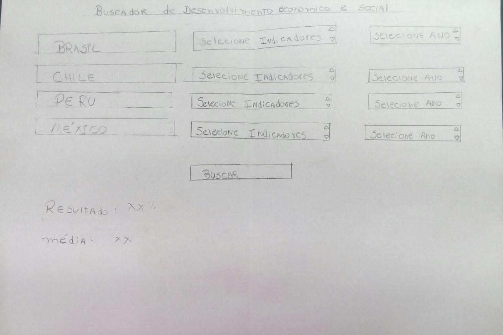

# Data Lovers

## Índice

* [1. Preâmbulo](#1-preâmbulo)
* [2. A escolha do tema](#2-tema)
* [3. O projeto](#3-oprojeto)

***

## 1. Preâmbulo

Segundo a [Forbes](https://www.forbes.com/sites/bernardmarr/2018/05/21/how-much-data-do-we-create-every-day-the-mind-blowing-stats-everyone-should-read)
90% dos dados que existem hoje foram gerados durante os últimos dois anos.
A cada dia geramos 2.5 milhões de terabytes de dados, uma cifra sem
precedentes. Uma grande cifra de dados necessita ser organizada e disponibilizada ao usuário de forma que possa ser ordenada e filtrada conforme a necessidade de busca de cada um, desta forma o projeto data lovers é essencial para acompanhar essa nova realidade.

## 2. Escolha do tema
Da necessidade de tratar um alto contigente de dados e converte-los em informações úteis, ordenadas e que possibilitem preciso acesso ao usuário atendendo os critérios de sua busca, optamos pelo Banco de dados do World Bank, com uma vasta quantidade de informações que quando organizadas retornam dados importantes sobre o desenvolvimento dos países Brasil, Chile, Peru e México. 

## 3. O projeto
Como informado anteriormente, optamos pelo uso das informações do World Bank, definimos as personas e a história do usuário. A escolha das personas foi desenvolvido estabelecida através das seguintes questões:

Quem são os usuários principais do produto?
Quais são os objetivos dos usuários com relação ao produto?
Quais são os dados mais relevantes que querem ver na interface e por quê?
Quando utilizam ou utilizariam o produto?

Quanto as histórias do usuário a cada sprint ou nova funcionalidade desenvolvida utilizamos as questões abaixo como guia de trabalho até implementação e usabilidade da funcionalidade:

Eu como usuário
Quero determinada coisa
Para realizar determinada coisa

### Organização

A concepção e desenvolvimento do produto foi organizado em sprints com período de uma semana cada, o projeto data lovers teve duração de 3 semanas. O progresso semanal do projeto foi organizado e acompanhado através do uso da ferramenta trello.

Cronograma semanal:

1ª Delimitação do tema, desenho do protótipo de baixa fidelidade, criação das personas, histórias de usuário, estudo das exigências para aceitação do projeto e estudo dos métodos para execução do produto. 

2ª Início da execução do produto, reestruturação da metodologia de estudo, uma vez que nos deparamos com dificuldades no apreendizado de alguns temas, gerenciamento de expectativas da dupla e entendimento da definição de pronto.

3ª Na terceira semana percebemos que o protótipo inicial precisaria de ajustes no código para cumprir com as funcionalidades definidas, desta forma o código foi reescrito do ponto inicial. A execução do produto seguindo as definições de pronto, preparação e excecução dos testes, elaboração do HTML e CSS e reestrutuação do código de acordo com o aprendizado de boas práticas e código limpo.

Definição de pronto: A definição de pronto levou em consideração as necessidades do usuário: selecionar, filtrar indicadores por dado, ano, receber a informação ordenada e a média do dado selecionado. 

### Personas

1) Joyce, 42 anos, brasileira;
profissão: Professora secundária de geografia;
Caracteristicas: Bem humorada, otimista e engajada em contribuir com um ensino público de qualidade.
Necessidades: fonte de dados evolutivos ordenados e de fácil acesso para estimular seus alunos em estudos comparativos sobre desenvolvimento.

2) Patricia, 16 anos, Mexicana;
Profissão: Estudante do ensino secundário;
Caracteristicas: Antenada nas redes sociais, gosta de ler, tem muitos amigos e grande senso de justiça social;
Necessidades: Base de dados para pesquisas escolares que possibilitem retorno rápido da informação. 

#### Protótipo de baixa fidelidade

